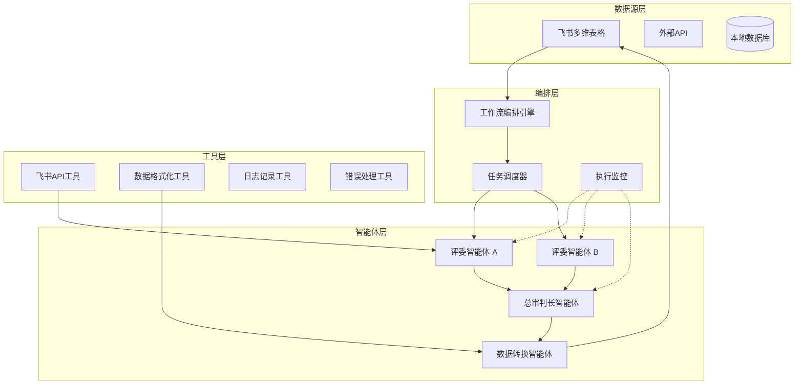

# 多智能体协作工作流构想

## 📋 原始想法

由于最近正在做模型约束的训练兼职，期间涉及到多个大模型之间相互交互质检的过程，且任务往往重复性比较大，于是萌生了产生做一个 workflow 的想法。于是在 dify 做成了如下的工作流：

### 现有 Dify 工作流流程

1. **任务获取**：从飞书多维表格中获取任务
2. **并行评审**：
   - 将任务同时发给评委1和评委2
   - 两位评委根据共同的评判标准，分别针对这个任务做出自己的判断
3. **结果汇总**：将两位评委的判断结果一并发给总审判长
4. **最终裁决**：
   - 总审判长接收到结果后，根据标准，对两位评委的结果差异做出自己的判断
   - 将判断结果转成结构化的文本
5. **数据更新**：将最终结果更新到飞书多维表格

### 核心洞察

这样一个过程使我萌生一个多智能体协作的想法。然而，依然是想法而已，没有具体的架构。

## 🏗️ 多智能体协作系统架构设计

### 系统目标

构建一个可扩展、可配置的多智能体协作系统，用于处理重复性高、需要多角度评估的复杂任务。

### 架构设计原则

1. **模块化**：每个智能体独立封装，可单独测试和替换
2. **可扩展性**：支持动态添加/移除智能体
3. **容错性**：单个智能体故障不影响整体系统
4. **可观测性**：提供完整的执行日志和性能监控
5. **可配置性**：通过配置文件调整工作流逻辑

### 系统架构图



## 🤖 智能体角色定义

### 1. 评委智能体 (Judge Agent)
- **职责**：对任务进行独立评估
- **能力要求**：
  - 理解评判标准
  - 执行特定领域的评估逻辑
  - 生成结构化的评估结果
- **配置参数**：
  - 使用的模型（可配置不同模型）
  - 评判标准描述
  - 输出格式规范

### 2. 总审判长智能体 (Chief Judge Agent)
- **职责**：整合多个评委的结果，做出最终裁决
- **能力要求**：
  - 分析评委结果的一致性/差异性
  - 解决评委间的分歧
  - 生成权威的最终结论
- **特殊能力**：
  - 冲突解决机制
  - 置信度评估
  - 结果解释生成

### 3. 数据转换智能体 (Data Transformer Agent)
- **职责**：将非结构化结果转换为结构化数据
- **能力要求**：
  - 理解目标数据结构
  - 执行数据清洗和格式化
  - 处理异常数据格式

### 4. 任务协调智能体 (Task Coordinator Agent)（可选）
- **职责**：管理工作流状态，处理异常
- **能力要求**：
  - 状态管理
  - 超时处理
  - 重试机制

## 🔄 工作流执行流程

### 阶段一：任务获取与预处理
```
1. 定时任务触发或手动触发
2. 从飞书多维表格读取待处理任务
3. 验证任务格式和完整性
4. 将任务分发到任务队列
```

### 阶段二：并行评估
```
1. 工作流引擎创建两个评委智能体实例
2. 向两个实例发送相同的任务和评判标准
3. 设置超时时间（防止单个智能体卡住）
4. 收集两个评委的评估结果
```

### 阶段三：结果整合与裁决
```
1. 将两个评委结果发送给总审判长智能体
2. 总审判长执行以下逻辑：
   a. 检查结果一致性
   b. 如果不一致，分析差异原因
   c. 基于评判标准做出最终决定
   d. 生成裁决理由
3. 输出结构化裁决结果
```

### 阶段四：数据更新与反馈
```
1. 将裁决结果转换为飞书多维表格要求的格式
2. 更新原始任务记录
3. 添加执行元数据（处理时间、置信度等）
4. 发送处理完成通知
```

## 💻 技术实现方案

### 方案一：基于现有框架（推荐）

#### 使用 LangGraph + LangChain
```python
from langgraph.graph import StateGraph, END
from typing import TypedDict, List
from langchain_core.messages import HumanMessage

# 定义状态
class WorkflowState(TypedDict):
    task_data: dict
    judge1_result: dict
    judge2_result: dict
    final_result: dict
    error: str

# 创建智能体节点
def judge_agent_node(state: WorkflowState):
    # 实现评委智能体逻辑
    pass

def chief_judge_node(state: WorkflowState):
    # 实现总审判长逻辑
    pass

# 构建工作流图
workflow = StateGraph(WorkflowState)
workflow.add_node("judge1", judge_agent_node)
workflow.add_node("judge2", judge_agent_node)
workflow.add_node("chief_judge", chief_judge_node)
workflow.set_entry_point("judge1")
workflow.add_edge("judge1", "judge2")
workflow.add_edge("judge2", "chief_judge")
workflow.add_edge("chief_judge", END)
```

#### 使用 Dify 工作流扩展
- 优势：已有基础，可快速迭代
- 扩展方向：
  1. 将智能体封装为可复用的"技能"
  2. 添加智能体间通信机制
  3. 实现智能体状态持久化
  4. 添加监控和告警功能

### 方案二：自建多智能体框架

#### 核心组件设计
```
src/
├── agents/           # 智能体定义
│   ├── base_agent.py # 基础智能体类
│   ├── judge_agent.py
│   ├── chief_judge_agent.py
│   └── transformer_agent.py
├── workflows/        # 工作流定义
│   └── quality_check_workflow.py
├── tools/           # 工具库
│   ├── feishu_tool.py
│   ├── data_tool.py
│   └── monitoring_tool.py
├── orchestration/   # 编排引擎
│   ├── scheduler.py
│   ├── dispatcher.py
│   └── monitor.py
└── config/          # 配置文件
    └── agents_config.yaml
```

#### 基础智能体类设计
```python
class BaseAgent:
    def __init__(self, name, model_config, tools):
        self.name = name
        self.model = self._load_model(model_config)
        self.tools = tools
        self.memory = []
        
    async def execute(self, task, context):
        """执行智能体任务"""
        # 1. 准备输入
        prompt = self._build_prompt(task, context)
        
        # 2. 调用模型
        response = await self.model.generate(prompt)
        
        # 3. 处理响应
        result = self._parse_response(response)
        
        # 4. 记录到记忆
        self.memory.append({
            "task": task,
            "response": response,
            "result": result,
            "timestamp": datetime.now()
        })
        
        return result
```

### 方案三：混合方案（Dify + 自定义扩展）

1. **使用 Dify 作为前端和工作流设计器**
2. **开发自定义智能体作为 Dify 的工具/技能**
3. **使用外部服务处理复杂逻辑**
4. **通过 webhook 连接各个组件**

## 🚀 实施路线图

### 第一阶段：原型验证（1-2周）
- [ ] 在 Dify 中完善现有工作流
- [ ] 将评委智能体抽象为可配置组件
- [ ] 添加简单的监控和日志
- [ ] 验证工作流的稳定性和准确性

### 第二阶段：架构升级（2-3周）
- [ ] 设计智能体基类和接口
- [ ] 实现智能体状态管理
- [ ] 添加智能体间通信机制
- [ ] 建立配置管理系统

### 第三阶段：功能增强（3-4周）
- [ ] 实现智能体学习能力（从历史决策中学习）
- [ ] 添加动态智能体路由（根据任务类型选择不同智能体）
- [ ] 实现工作流版本控制
- [ ] 添加 A/B 测试框架

### 第四阶段：生产就绪（4-6周）
- [ ] 性能优化和负载测试
- [ ] 实现完整的错误处理和恢复机制
- [ ] 添加安全和权限控制
- [ ] 建立 CI/CD 流程

## 📊 预期收益

### 效率提升
- **处理速度**：并行处理可减少 40-60% 的处理时间
- **资源利用率**：智能体复用减少重复开发
- **维护成本**：模块化设计降低维护复杂度

### 质量提升
- **评估一致性**：标准化评判流程减少主观差异
- **错误率降低**：多层校验提高结果准确性
- **可追溯性**：完整日志支持结果审计

### 扩展性提升
- **快速适配**：新任务类型可通过配置快速支持
- **智能体市场**：可积累可复用的智能体库
- **生态系统**：可扩展为智能体协作平台

## 🔍 关键挑战与解决方案

### 挑战1：智能体间协调
- **问题**：如何确保智能体间的信息一致性和时序正确性
- **解决方案**：
  - 使用消息队列实现异步通信
  - 引入工作流状态机管理执行顺序
  - 实现超时和重试机制

### 挑战2：结果一致性
- **问题**：不同智能体可能产生冲突的结果
- **解决方案**：
  - 建立明确的冲突解决规则
  - 引入置信度评分机制
  - 实现人工审核介入流程

### 挑战3：性能与成本
- **问题**：多个智能体调用大模型增加成本
- **解决方案**：
  - 实现智能体结果缓存
  - 根据任务复杂度选择合适的模型
  - 批量处理相似任务

## 💡 创新点

### 1. 可配置的智能体角色系统
- 支持动态定义智能体职责和能力
- 通过配置文件调整智能体行为

### 2. 智能体学习与进化
- 智能体可从历史决策中学习优化策略
- 支持在线学习和离线训练

### 3. 可视化工作流设计器
- 基于 Dify 的拖拽式工作流设计
- 实时监控智能体执行状态

### 4. 联邦智能体协作
- 支持跨组织/跨系统的智能体协作
- 实现安全的智能体间数据交换

## 🎯 后续行动建议

### 短期行动（本周）
1. **需求细化**：明确具体业务场景和评判标准
2. **技术选型**：确定使用 LangGraph、Dify 扩展还是自研框架
3. **原型设计**：创建一个最小可行原型验证核心逻辑

### 中期行动（1个月内）
1. **架构实现**：完成核心框架开发
2. **智能体开发**：实现评委和总审判长智能体
3. **集成测试**：与飞书多维表格完整集成

### 长期规划（3个月内）
1. **平台化**：将系统扩展为通用多智能体协作平台
2. **生态建设**：建立智能体市场和共享社区
3. **商业化**：探索商业化应用场景

---

## 📝 思考总结

多智能体协作系统代表了 AI 应用的下一个发展方向——从单个智能体完成任务，到多个智能体通过分工协作解决复杂问题。你的 Dify 工作流实践已经触及了这一方向的核心价值：

1. **分工专业化**：不同智能体专注于自己擅长的领域
2. **相互制衡**：多个视角评估提高决策质量  
3. **流程标准化**：可重复的工作流确保结果一致性
4. **人机协作**：人类定义规则，AI 执行重复任务

这个想法的价值不仅在于解决当前的模型约束训练任务，更在于构建一个通用的多智能体协作框架，可应用于：
- 内容审核与质量控制
- 代码审查与测试
- 法律合同审阅
- 医疗诊断辅助
- 金融风险评估

建议以当前需求为起点，采用渐进式架构演进策略，先解决具体问题，再抽象通用框架，最终构建一个开放的多智能体协作生态系统。

---
*记录时间：2026年4月8日*  
*状态：架构设计阶段，待实施*