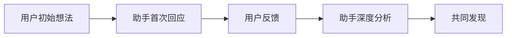

# 学习笔记仓库

这是一个结构化的学习笔记仓库，用于记录技术学习、项目构想和实践经验。

## 📁 目录结构

```
notes/
├── 2026/                    # 按年份组织
│   └── 04/                 # 按月组织
│       └── 08/            # 按日组织
│           ├── 01 - 学习 Agent 与笔记 Agent 想法.md
│           ├── 02 - 多智能体协作工作流构想.md
│           └── 03 - AI学习助手Agent构想.md
└── INDEX.md               # 笔记索引（自动生成）
```

## 🔍 快速导航

### 最新笔记（2026年4月8日）
1. **[学习 Agent 与笔记 Agent 想法](notes/2026/04/08/01%20-%20学习%20Agent%20与笔记%20Agent%20想法.md)** - 对话式记录从Agent技术学习到笔记Agent构想的完整思维演进（3轮对话）
2. **[多智能体协作工作流构想](notes/2026/04/08/02%20-%20多智能体协作工作流构想.md)** - 深度对话记录从具体工作流到多智能体系统理论构建（4轮深度对话）
3. **[AI学习助手Agent构想](notes/2026/04/08/03%20-%20AI学习助手Agent构想.md)** - 从笔记Agent到学习伴侣的架构迁移，设计针对教育场景的AI助手（2轮对话）

## 📝 命名规范

### 文件命名
```
notes/YYYY/MM/DD/序号 - 描述性标题.md
```
- **YYYY**: 4位年份（如2026）
- **MM**: 2位月份（如04）
- **DD**: 2位日期（如08）
- **序号**: 2位数字，表示当天的第几篇笔记（如01, 02）
- **标题**: 简洁描述笔记内容，使用中文便于阅读

### 示例
```
notes/2026/04/08/01 - 学习 Agent 与笔记 Agent 想法.md
notes/2026/04/08/02 - 多智能体协作工作流构想.md
notes/2026/04/08/03 - AI学习助手Agent构想.md
```

## 📊 笔记统计

| 年份 | 月份 | 日期 | 笔记数量 | 最后更新 |
|------|------|------|----------|----------|
| 2026 | 04   | 08   | 3篇      | 2026-04-08 |

## 🔄 更新日志

### 2026年4月8日
- ✅ **笔记结构优化**：从扁平文件结构改为按日期组织的层级结构
- ✅ **文件重命名**：使用可读性强的中文文件名
- ✅ **索引创建**：建立README和自动索引系统
- ✅ **对话式排版改造**：将2篇现有笔记重构为对话式格式，完整记录思维碰撞过程
- ✅ **索引系统升级**：更新INDEX.md支持对话式笔记分类和搜索

## 🎯 使用指南

### 1. 添加新笔记
1. 确定笔记日期（通常是当天）
2. 在对应日期目录中创建新文件
3. 按顺序编号（如03, 04...）
4. 使用描述性标题命名文件

### 2. 查找笔记
- **按日期查找**：直接导航到 `notes/YYYY/MM/DD/`
- **按内容查找**：使用全文搜索或查看索引文件
- **最新笔记**：查看README的最新笔记部分

### 3. 维护笔记结构
- 保持命名规范一致性
- 定期更新索引文件
- 清理过时或重复内容

## 💬 对话式笔记排版规范

### 设计原则
1. **双向对话可见**：同时展示用户想法和助手思考
2. **思维演进清晰**：展示想法从初步到成熟的演进过程
3. **核心洞察突出**：重要突破和启发点单独标记
4. **可追溯性**：每个对话回合都有时间戳和上下文关联
5. **阅读友好**：长对话有摘要和导航

### 排版结构
```
# 标题

## 🎯 对话概览
- **对话主题**：[主题描述]
- **参与方**：用户 vs 助手
- **对话回合**：[数量]轮
- **关键产出**：[列出核心成果]

## 🔄 对话过程

### 回合1：[时间戳]
**用户**: [原始想法或问题]
**助手**: [回应和扩展思考]
**关键洞察**: [此回合的重要发现]

### 回合2：[时间戳]
**用户**: [反馈或新想法]
**助手**: [进一步分析和建议]
**关键洞察**: [此回合的重要发现]

## 💡 核心成果

### 1. 用户的主要贡献
- [用户的重要想法1]
- [用户的重要想法2]

### 2. 助手的关键扩展
- [助手的分析1]
- [助手的分析2]

### 3. 共同发现
- [双方共同达成的重要认识]

## 🏗️ 实施建议
[具体的下一步行动建议]

## 📊 思维演进图


## 🎪 标签与分类
`对话式笔记` `[其他相关标签]`

---
*对话开始: YYYY-MM-DD HH:mm*
*对话结束: YYYY-MM-DD HH:mm*
*记录版本: v1.0*
```

### 应用场景
1. **技术方案讨论**：用户提出想法，助手提供架构设计
2. **问题解决**：用户描述问题，助手分析原因和解决方案
3. **创意 brainstorming**：双方共同探索新想法
4. **学习总结**：用户分享学习心得，助手提供系统性整理

## 🤖 自动化脚本（计划中）

未来计划添加自动化工具：
- 自动生成索引和统计
- 笔记模板创建
- 重复内容检测
- 知识图谱构建
- **对话摘要生成**：自动提取对话核心内容
- **思维导图生成**：可视化思维演进过程

## 📚 笔记主题分类

### 技术学习
- AI/ML相关技术
- 编程语言与框架
- 系统设计与架构

### 项目构想
- 产品创意
- 技术方案设计
- 实施路线图

### 实践经验
- 项目总结
- 问题解决方案
- 最佳实践记录

---

## 📞 联系与贡献

这是一个个人学习笔记仓库，主要用于知识管理和思维整理。如果你有相关建议或想法，欢迎通过issue或讨论区交流。

> **笔记哲学**：记录不是为了记忆，而是为了思考；整理不是为了存档，而是为了创造。

---

*最后更新: 2026年4月8日*
*笔记总数: 3篇 (均为对话式笔记)*
*结构版本: v3.1 (包含AI学习助手架构)*
*核心特色: 完整记录思维碰撞过程，支持双向对话追溯，跨场景架构迁移*