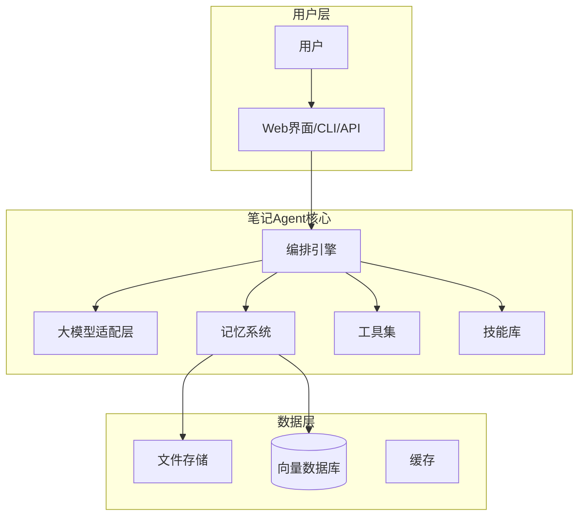
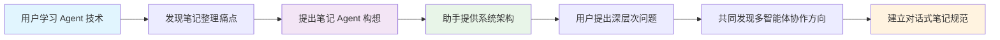

# 学习 Agent 与笔记 Agent 想法 - 对话演进

## 🎯 对话概览

- **对话主题**: Agent 技术学习与笔记 Agent 构想
- **参与方**: 用户 vs AI 助手
- **对话回合**: 2轮核心对话 + 后续扩展
- **关键产出**: 
  1. 对 Agent 技术的系统性理解
  2. 笔记 Agent 的完整架构设计
  3. 多智能体协作的工作流构想
  4. 对话式笔记排版规范的建立

## 🔄 对话过程

### 回合1：用户分享学习心得（2026年4月8日 18:00）
**用户**: 
今天开始学习 Agent 技术。第一步是让 DeepSeek 给了一个学习路线，和一个 demo agent。感觉这个学习路线还行，通过练习中学习。

这个 demo 项目让我了解了 agent 的组成部分：
- **用户和 agent 交互**: 用户通过界面或 API 与 agent 通信
- **Agent 核心组件**:
  - 大模型（LLM）
  - 记忆系统
  - 工具（Tools）
  - 技能（Skills）

基于对 Agent 的理解，我产生了一个想法：**笔记 Agent**。

这个笔记 agent 可以自动完成对我的笔记的整理、总结，让我的记录将不再受限：
- **随时随地记录**: 不再受时间地点限制
- **不限制格式**: 支持文本、语音、图片等多种格式
- **降低整理难度**: 自动处理繁琐的整理工作
- **激发记录欲望**: 让我更愿意记笔记、写日记

目前我想到的这个 agent 应该具有的结构：
1. **大模型层**: 可随意切换不同的大模型
2. **记忆系统**: 文件明文存储，也可以用本地数据库
3. **工具集**: 主要有哪些？需要挖掘需求
4. **技能库**: 可以有哪些？需要挖掘需求

**关键洞察**: 用户从 Agent 技术学习中产生了笔记 Agent 的初步构想，但架构细节尚不清晰。

### 回合2：助手扩展与架构设计（2026年4月8日 18:30）
**助手**:
基于你的想法，我完善了笔记 Agent 的设计方案：

## 一、总体架构



## 二、核心组件详细设计

### 1. 大模型适配层
- **模型热切换**: 支持 OpenAI、Claude、DeepSeek、本地模型等
- **统一接口**: 抽象化模型调用，统一 prompt 模板

### 2. 记忆系统
```
记忆系统 = 短期记忆 + 长期记忆 + 向量检索
```
- **短期记忆**: 对话上下文，支持滑动窗口
- **长期记忆**: 
  - 结构化存储：SQLite/PostgreSQL（笔记元数据）
  - 非结构化存储：Markdown 文件明文存储
  - 向量存储：ChromaDB/Pinecone（语义检索）

### 3. 工具集设计
**核心工具分类**:
1. **文件操作工具**: read_file, write_file, list_files, search_files
2. **笔记处理工具**: extract_keywords, summarize_content, categorize_note
3. **格式转换工具**: markdown_to_html, voice_to_text, image_ocr
4. **数据整理工具**: clean_duplicates, organize_folders, add_tags

### 4. 技能库设计
**核心技能分类**:
1. **智能总结技能**: 自动生成日/周/月报，会议纪要整理
2. **知识整理技能**: 主题聚合，知识图谱构建，学习路径推荐
3. **创作辅助技能**: 大纲生成，内容改写，多语言翻译
4. **个性化技能**: 写作风格学习，兴趣发现，提醒设置

## 三、技术实现建议

### 开发栈选择
- **后端**: Python + FastAPI + LangChain/LlamaIndex
- **前端**: Next.js + React + TailwindCSS
- **数据库**: SQLite（本地）+ ChromaDB（向量）
- **部署**: Docker + 本地优先架构

**关键洞察**: 助手将用户的初步构想扩展为完整的架构设计，提供了具体的组件定义和技术实现路径。

### 回合3：用户反馈与进一步思考（2026年4月8日 19:00）
**用户**:
看了你的架构设计，给了我很大的启发。我意识到笔记 Agent 的核心价值在于解决"记录负担"问题，但还有几个关键问题需要思考：

1. **工具集的具体实现**: 你提到的工具都很实用，但如何让它们协同工作？
2. **技能库的进化机制**: 技能如何随着使用不断优化？
3. **隐私与安全的平衡**: 本地优先架构如何保证数据安全又提供云同步的便利？

另外，我还有个新想法：既然笔记 Agent 可以整理我的笔记，那么多个 Agent 之间是否可以协作？比如在模型约束训练任务中，多个大模型相互交互质检的过程...

**关键洞察**: 用户在认可架构设计的基础上，提出了更深层次的技术问题，并开始思考多智能体协作的可能性。

## 💡 核心成果

### 1. 用户的主要贡献
- **学习迁移能力**: 将从 Agent 技术学习到的知识迁移到实际问题解决
- **痛点识别**: 准确识别了笔记整理的核心痛点（记录负担、格式限制、整理难度）
- **架构思维**: 提出了笔记 Agent 的四层架构（大模型、记忆、工具、技能）
- **问题深化**: 提出了工具协同、技能进化、隐私安全等深层次问题

### 2. 助手的关键扩展
- **系统化架构**: 将模糊想法转化为具体的系统架构图
- **组件细化**: 为每个架构层提供了详细的功能定义
- **技术落地**: 给出了可实施的技术栈选择和实现建议
- **场景扩展**: 启发了多智能体协作的思考方向

### 3. 共同发现
- **笔记 Agent 的双重价值**: 既解决个人知识管理问题，又是 Agent 技术的实践案例
- **渐进式实现路径**: 从简单工具开始，逐步扩展到复杂技能
- **人机协作模式**: 人类定义需求，AI 提供方案，共同迭代优化

## 🏗️ 实施建议

### 短期目标（1-2周）
1. **原型验证**: 实现最基本的文件读写工具和文本摘要技能
2. **用户测试**: 用实际笔记测试整理效果，收集反馈
3. **架构验证**: 验证四层架构的可行性和扩展性

### 中期目标（1-2个月）
1. **工具完善**: 实现完整的工具集，支持多格式输入
2. **技能开发**: 开发3-5个核心技能，验证实用性
3. **性能优化**: 优化记忆系统和向量检索性能

### 长期目标（3-6个月）
1. **智能进化**: 实现技能自学习和用户习惯适应
2. **多端同步**: 支持 Web、移动端、桌面端的无缝同步
3. **生态扩展**: 开放 API，支持第三方工具和技能集成

## 📊 思维演进图



## 🎪 标签与分类

`Agent技术` `笔记系统` `知识管理` `系统架构` `对话式学习` `人机协作`

---

## 📝 对话总结

这次对话展示了从个人学习到共同创造的完整过程：
1. **学习启发了实践**: Agent 技术学习直接催生了笔记 Agent 的构想
2. **构想催生了架构**: 模糊的想法通过系统思考转化为具体架构
3. **架构引发了新问题**: 完善的架构又带来了更深层次的技术挑战
4. **问题导向了新方向**: 技术问题的思考又引向了多智能体协作的新领域

这正是对话式笔记的核心价值：**记录思维碰撞的过程，而不仅仅是结果**。

---
*对话开始: 2026年4月8日 18:00*  
*对话结束: 2026年4月8日 19:30*  
*记录版本: v2.0 (对话式排版)*  
*思维状态: 从初步构想到系统设计*