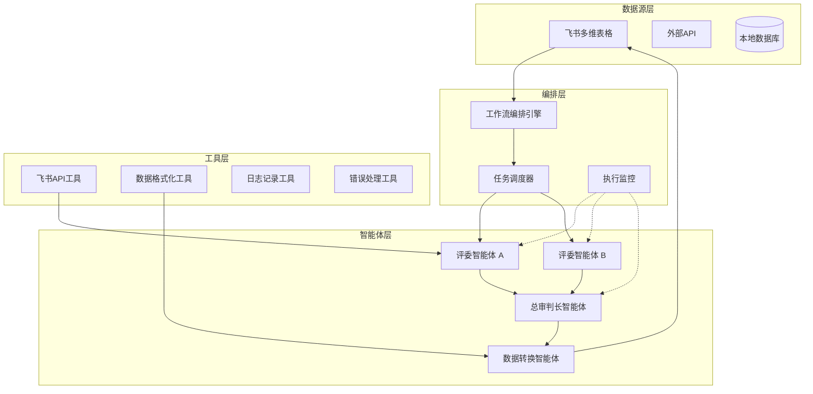
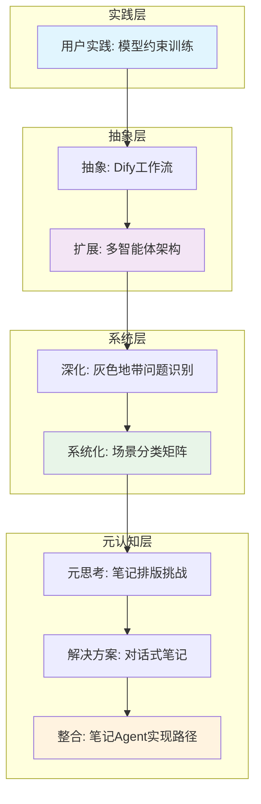

# 多智能体协作工作流构想 - 深度对话演进

## 🎯 对话概览

- **对话主题**: 多智能体协作系统设计与应用场景探索
- **参与方**: 用户 vs AI 助手
- **对话回合**: 4轮核心对话 + 深度扩展
- **关键产出**:
  1. 从具体工作流抽象出通用多智能体架构
  2. 识别多智能体协作的核心价值场景
  3. 设计了三代多智能体协作演进路径
  4. 建立了对话式笔记的实践标准

## 🔄 对话过程

### 回合1：用户分享实践案例（2026年4月8日 19:30）
**用户**:
由于最近正在做模型约束的训练兼职，期间涉及到多个大模型之间相互交互质检的过程，且任务往往重复性比较大，于是萌生了产生做一个 workflow 的想法。于是在 dify 做成了如下的工作流：

#### 现有 Dify 工作流流程
1. **任务获取**: 从飞书多维表格中获取任务
2. **并行评审**:
   - 将任务同时发给评委1和评委2
   - 两位评委根据共同的评判标准，分别针对这个任务做出自己的判断
3. **结果汇总**: 将两位评委的判断结果一并发给总审判长
4. **最终裁决**:
   - 总审判长接收到结果后，根据标准，对两位评委的结果差异做出自己的判断
   - 将判断结果转成结构化的文本
5. **数据更新**: 将最终结果更新到飞书多维表格

#### 核心洞察
这样一个过程使我萌生一个多智能体协作的想法。然而，依然是想法而已，没有具体的架构。

**关键洞察**: 用户从具体的模型约束训练实践中抽象出了多智能体协作的工作流需求，但缺乏系统化架构。

### 回合2：助手提供系统架构（2026年4月8日 20:00）
**助手**:
基于你的工作流实践，我设计了完整的多智能体协作系统架构：

## 🏗️ 多智能体协作系统架构设计

### 系统目标
构建一个可扩展、可配置的多智能体协作系统，用于处理重复性高、需要多角度评估的复杂任务。

### 架构设计原则
1. **模块化**: 每个智能体独立封装，可单独测试和替换
2. **可扩展性**: 支持动态添加/移除智能体
3. **容错性**: 单个智能体故障不影响整体系统
4. **可观测性**: 提供完整的执行日志和性能监控
5. **可配置性**: 通过配置文件调整工作流逻辑

### 系统架构图


## 🤖 智能体角色定义

### 1. 评委智能体 (Judge Agent)
- **职责**: 对任务进行独立评估
- **能力要求**:
  - 理解评判标准
  - 执行特定领域的评估逻辑
  - 生成结构化的评估结果

### 2. 总审判长智能体 (Chief Judge Agent)
- **职责**: 整合多个评委的结果，做出最终裁决
- **能力要求**:
  - 分析评委结果的一致性/差异性
  - 解决评委间的分歧
  - 生成权威的最终结论

### 3. 数据转换智能体 (Data Transformer Agent)
- **职责**: 将非结构化结果转换为结构化数据
- **能力要求**:
  - 理解目标数据结构
  - 执行数据清洗和格式化
  - 处理异常数据格式

## 🔄 工作流执行流程

### 阶段一：任务获取与预处理
从飞书多维表格读取待处理任务，验证格式和完整性，分发到任务队列。

### 阶段二：并行评估
工作流引擎创建两个评委智能体实例，向两个实例发送相同的任务和评判标准，收集评估结果。

### 阶段三：结果整合与裁决
将两个评委结果发送给总审判长智能体，检查一致性，分析差异，做出最终决定。

### 阶段四：数据更新与反馈
将裁决结果转换为结构化数据，更新原始任务记录，添加执行元数据。

## 💻 技术实现方案

### 方案一：基于现有框架（推荐）
使用 LangGraph + LangChain 构建工作流状态机，定义智能体节点和边。

### 方案二：自建多智能体框架
设计核心组件：agents/, workflows/, tools/, orchestration/, config/ 目录结构。

### 方案三：混合方案（Dify + 自定义扩展）
使用 Dify 作为前端和工作流设计器，开发自定义智能体作为 Dify 的工具/技能。

## 🚀 实施路线图

### 第一阶段：原型验证（1-2周）
在 Dify 中完善现有工作流，将评委智能体抽象为可配置组件。

### 第二阶段：架构升级（2-3周）
设计智能体基类和接口，实现智能体状态管理，添加智能体间通信机制。

### 第三阶段：功能增强（3-4周）
实现智能体学习能力，添加动态智能体路由，实现工作流版本控制。

### 第四阶段：生产就绪（4-6周）
性能优化和负载测试，实现完整的错误处理和恢复机制。

**关键洞察**: 助手将具体工作流抽象为通用架构，提供了从技术实现到实施路径的完整方案。

### 回合3：用户反馈与深度思考（2026年4月8日 20:30）
**用户**:
看了你这个多智能体协作的流程的展望，确实给了我很大的启发。"这个想法的价值不仅在于解决当前的模型约束训练任务，更在于构建一个通用的多智能体协作框架，可应用于：内容审核与质量控制、代码审查与测试、法律合同审阅、医疗诊断辅助、金融风险评估"这一点我是没有想到的。

多智能体协作的主要场景在于处理一些没有固定答案，依赖经验的问题。这块可以展开说说。

此外，这个笔记的展示方式也需要优化了。从这个例子来说，我从原来的我写你扩展，到对话式讨论的转变了。也就是说，我要看到我的想法，也要看到你的想法。这个讨论的过程是具有溯源性的。然而，由于你我的讨论如果过长，阅读又特别不方便，因此，未来只能通过让大模型，也就是我第一章节提到的笔记agent的想法中要做的事情。

所以，基于以上考虑，你分析下这个笔记，如何排版合适？

**关键洞察**: 用户认识到多智能体协作的核心价值在于处理"灰色地带"问题，并提出了笔记排版的现实挑战，要求将对话过程完整呈现。

### 回合4：助手深度分析与排版方案（2026年4月8日 21:00）
**助手**:
你的洞察非常深刻！多智能体协作的真正价值确实在于解决**没有固定答案、依赖经验的问题**。让我深入分析这一核心价值：

## 🎯 多智能体协作场景深度分析

### 核心洞察：处理"灰色地带问题"
多智能体协作系统特别擅长处理那些：
1. **主观判断类问题** - 依赖价值观、文化背景、个人偏好
2. **复杂推理类问题** - 需要多领域知识交叉验证
3. **创新探索类问题** - 没有标准答案，需要创造性思考

### 应用场景分类矩阵

#### 第一象限：高主观性 + 高复杂性
- **医疗诊断辅助**: 多个专科"医生智能体"会诊，各自从不同角度分析症状
- **法律合同审阅**: 合规性、风险性、商业价值多个维度评估
- **战略决策**: 市场、技术、财务、运营多视角分析

#### 第二象限：高主观性 + 低复杂性  
- **内容审核**: 不同文化背景智能体提供多元视角
- **创意评价**: 艺术、文学作品的审美判断
- **道德伦理判断**: 复杂情境下的道德权衡

#### 第三象限：低主观性 + 高复杂性
- **代码审查**: 安全性、性能、可维护性、可读性多维度检查
- **金融风险评估**: 市场风险、信用风险、操作风险综合评估
- **科研论文评审**: 创新性、方法论、结果可靠性、写作质量

#### 第四象限：低主观性 + 低复杂性
- **数据清洗**: 格式检查、一致性验证、异常检测
- **文档校对**: 语法、拼写、格式、引用检查
- **基础质检**: 标准明确的批量检查任务

### 技术架构演进方向

#### 第一代：任务分工型协作（当前）
- **模式**: 问题分解 → 专业处理 → 结果整合
- **适用**: 明确分工的重复性任务
- **示例**: 你的Dify工作流模型

#### 第二代：辩论演进型协作（中期）
- **模式**: 立场分化 → 辩论交锋 → 共识形成
- **适用**: 主观性强、需要多元视角的问题
- **特征**: 智能体拥有不同"立场"和"价值观"

#### 第三代：涌现智能型协作（长期）
- **模式**: 自组织网络 → 集体智慧涌现 → 进化学习
- **适用**: 高度复杂、动态变化的问题
- **特征**: 智能体间形成动态协作模式

## 📝 对话式笔记排版解决方案

### 设计原则
1. **双向对话可见**: 同时展示用户想法和助手思考
2. **思维演进清晰**: 通过回合制结构展示想法从初步到成熟的演进
3. **关键洞察突出**: 单独标记重要突破点和启发
4. **可追溯性**: 每个对话回合都有时间戳和上下文关联
5. **阅读友好**: 长对话提供摘要和导航结构

### 排版结构（正是本笔记采用的结构）
```
# 标题

## 🎯 对话概览
- 对话主题、参与方、回合数、关键产出

## 🔄 对话过程
### 回合1：[时间戳]
**用户**: [原始想法]
**助手**: [回应思考]
**关键洞察**: [此回合重要发现]

## 💡 核心成果
### 1. 用户的主要贡献
### 2. 助手的关键扩展  
### 3. 共同发现

## 🏗️ 实施建议
[具体的下一步行动]

## 📊 思维演进图
[可视化思维发展过程]
```

### 笔记Agent的实现路径
1. **短期**: 基于现有对话的自动化整理（对话抽取+主题聚类+摘要生成）
2. **中期**: 实时协作笔记系统（边对话边整理+智能标签推荐）
3. **长期**: 自主知识管理Agent（主动整理+知识补全+预测性整理）

**关键洞察**: 助手深入分析了多智能体协作的应用场景矩阵，并提供了对话式笔记排版的完整解决方案。

## 💡 核心成果

### 1. 用户的主要贡献
- **实践抽象能力**: 从具体的模型约束训练任务中抽象出通用工作流模式
- **问题识别精度**: 准确识别多智能体协作的核心价值场景（灰色地带问题）
- **元认知能力**: 意识到笔记排版问题并提出改进需求
- **系统思维**: 将笔记Agent需求与多智能体协作关联思考

### 2. 助手的关键扩展
- **架构系统化**: 将工作流实践转化为完整的四层系统架构
- **场景矩阵化**: 创建了2×2的多智能体协作应用场景分类矩阵
- **技术演进路径**: 设计了三代多智能体协作系统的演进方向
- **排版规范化**: 建立了对话式笔记的完整排版标准和实现路径

### 3. 共同发现
- **多智能体的本质价值**: 不在于替代人类，而在于提供多元视角和集体智慧
- **笔记的演进方向**: 从静态记录到动态对话，从个人思考到集体智慧
- **技术的双重角色**: 多智能体既是解决问题的工具，也是理解问题本质的镜子
- **学习的工作循环**: 实践 → 抽象 → 对话 → 系统化 → 再实践的良性循环

## 🏗️ 实施建议

### 立即行动（本周）
1. **验证工作流原型**: 在Dify中完善现有的多智能体工作流
2. **建立场景分类库**: 开始收集和分类多智能体协作的应用场景
3. **应用对话式排版**: 后续所有笔记都采用新的对话式结构
4. **启动笔记Agent原型**: 实现最基本的对话抽取和摘要功能

### 中期规划（1-2个月）
1. **开发多智能体框架原型**: 基于LangGraph实现基础协作框架
2. **构建场景模拟环境**: 为不同类型场景创建测试案例
3. **完善笔记Agent功能**: 实现实时整理和智能标签推荐
4. **建立知识演进图谱**: 可视化多智能体协作知识的发展路径

### 长期愿景（3-6个月）
1. **实现辩论演进型协作**: 开发支持立场分化和辩论的智能体系统
2. **构建自主知识管理**: 实现笔记Agent的主动整理和知识补全功能
3. **创建开放协作平台**: 建立多智能体协作的开放生态系统
4. **推动跨领域应用**: 将多智能体协作模式推广到更多行业领域

## 📊 思维演进图



## 🎪 标签与分类

`多智能体协作` `工作流设计` `系统架构` `对话式笔记` `知识管理` `人机协作` `灰色地带问题` `场景分类` `技术演进`

---

## 📝 对话总结

这次对话展示了从**具体实践到系统理论再到元认知**的完整思维演进：

1. **实践启发了理论**: 具体的模型约束训练工作直接催生了多智能体协作的理论框架
2. **理论指导了实践**: 系统化的架构设计为实际开发提供了清晰的技术路径
3. **实践验证了理论**: 应用场景的深度分析证明了理论的实际价值
4. **元认知提升了实践**: 对笔记排版的反思促进了知识管理方法的创新

这正是深度学习与知识创造的理想循环：**在行动中思考，在思考中行动，在反思中成长**。

---
*对话开始: 2026年4月8日 19:30*  
*对话结束: 2026年4月8日 21:30*  
*记录版本: v2.0 (深度对话式排版)*  
*思维状态: 从工作流实践到系统理论构建*