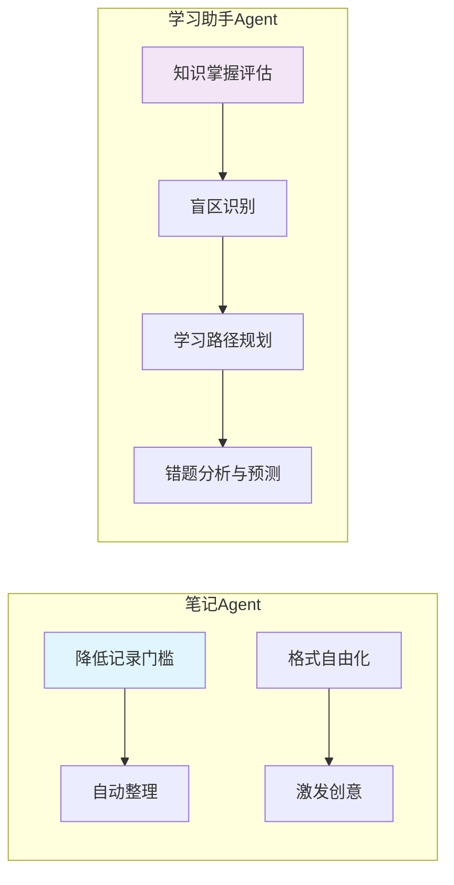
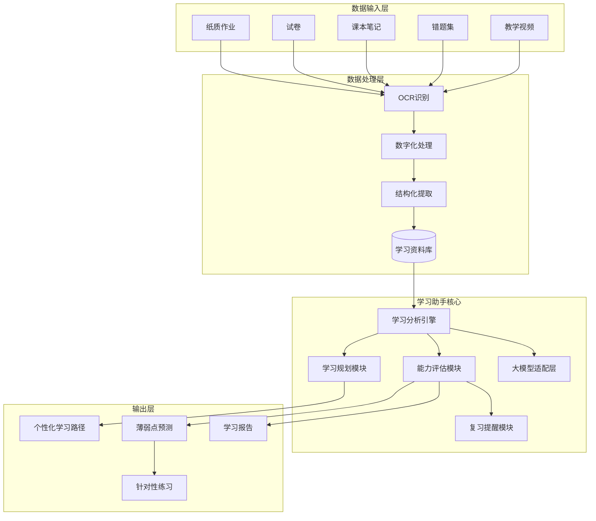
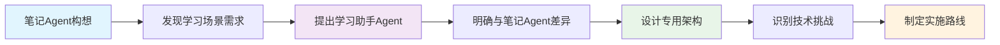

# AI学习助手Agent构想 - 从笔记Agent到学习伴侣

## 🎯 对话概览

- **对话主题**: AI学习助手Agent的构想与设计
- **参与方**: 用户 vs AI 助手
- **对话回合**: 1轮核心对话 + 架构扩展
- **关键产出**:
  1. 明确了AI学习助手Agent的核心价值定位
  2. 对比了学习助手Agent与笔记Agent的异同
  3. 设计了针对学习场景的专用架构
  4. 提出了数据采集与隐私保护方案

## 🔄 对话过程

### 回合1：用户提出AI学习助手构想（2026年4月8日 20:00）

**用户**:
我想到之前有个想法，把孩子的作业，卷子，课本笔记，错题等资料收集起来数字化。然后喂给大模型，让他记下来，然后为未来学习新东西，复习保驾护航，做一个ai学习助手。

现在有了agent之后，这个想法具象化了。这个想法和我的笔记agent特别相似，只不过侧重点不同。笔记侧重发散。而学习助手agent则侧重总结，挖掘盲区。

**关键洞察**: 用户将笔记Agent的架构思维迁移到教育场景，提出了专门针对学习过程的AI助手构想，明确了其与笔记Agent的差异定位。

### 回合2：助手扩展分析与架构设计（2026年4月8日 20:30）

**助手**:
基于你的想法，我进行了深入分析并设计了专门的AI学习助手Agent架构。

## 🏗️ 学习助手Agent vs 笔记Agent：核心差异分析

### 目标定位对比

| 维度 | 笔记Agent | 学习助手Agent |
|------|-----------|---------------|
| **核心目标** | 降低记录负担，激发记录欲望 | 提高学习效率，挖掘知识盲区 |
| **使用场景** | 个人知识管理、创意记录 | 系统化学习、复习备考 |
| **处理内容** | 自由格式笔记、想法、灵感 | 结构化学习资料（作业、试卷、错题） |
| **输出导向** | 整理、归纳、关联 | 总结、评估、预测、规划 |
| **思维模式** | 发散性思维、创造性连接 | 收敛性思维、系统性评估 |

### 功能重点对比



## 🏛️ AI学习助手Agent架构设计

### 总体架构图



### 核心组件设计

#### 1. 数据采集与数字化模块
- **多模态输入支持**: 作业照片、试卷扫描、手写笔记、语音记录
- **智能OCR识别**: 支持中文手写体、数学公式、图表提取
- **结构化提取**: 自动识别题目、答案、解析、知识点标签
- **时间序列管理**: 按学习时间线组织资料，建立学习历程档案

#### 2. 学习分析引擎
- **知识点图谱构建**: 自动关联学习内容与课程标准知识点
- **掌握度评估算法**: 基于历史表现预测知识掌握程度
- **盲区识别模型**: 分析错题模式，识别系统性知识缺陷
- **学习效率分析**: 评估学习时间投入与产出效果

#### 3. 个性化学习规划模块
- **自适应学习路径**: 基于当前掌握情况推荐下一步学习内容
- **复习间隔优化**: 应用艾宾浩斯遗忘曲线原理安排复习
- **难度递进策略**: 根据进步情况动态调整练习难度
- **兴趣引导机制**: 结合学习兴趣推荐拓展内容

#### 4. 交互与反馈系统
- **自然语言问答**: 支持针对学习内容的提问与解答
- **错题讲解生成**: 自动生成错题的详细解析和相似题目
- **学习进展可视化**: 仪表板展示学习成果和进步趋势
- **家长/教师报告**: 定期生成学习情况报告

## 🔍 核心技术挑战与解决方案

### 挑战1：多模态学习资料处理
- **问题**: 作业照片质量参差，手写字体识别困难
- **方案**: 集成多个OCR引擎，建立手写样本库持续优化

### 挑战2：知识点自动标注
- **问题**: 学习内容与知识点自动关联难度大
- **方案**: 结合课程标准和教材目录建立知识图谱，使用LLM进行语义匹配

### 挑战3：个性化学习路径生成
- **问题**: 如何平衡系统性学习与个性化需求
- **方案**: 设计分层学习目标体系，允许用户调整学习节奏

### 挑战4：隐私与数据安全
- **问题**: 学习资料包含敏感个人信息
- **方案**: 本地优先架构，端到端加密，可选云端同步

## 🛠️ 技术实现建议

### 开发栈选择
- **后端**: Python + FastAPI + PyTorch/TensorFlow
- **OCR引擎**: PaddleOCR + EasyOCR + 自定义模型
- **向量数据库**: ChromaDB / Pinecone（用于知识点检索）
- **前端**: Next.js + React + Ant Design
- **移动端**: React Native（支持拍照上传）
- **部署**: Docker + 本地优先，可选私有云部署

### 数据存储架构
```
学习资料库/
├── 原始资料/          # 原始扫描件、照片
├── 数字化内容/        # OCR识别后的文本
├── 结构化数据/        # 提取的题目、知识点
├── 学习记录/          # 学习行为日志
└── 分析结果/          # 评估报告、学习路径
```

## 🚀 实施路线图

### 阶段1：原型验证（2-4周）
1. **基础OCR功能**: 实现作业照片的文字提取
2. **简单错题管理**: 手动标注错题，生成错题集
3. **基础问答功能**: 针对学习内容的简单问答

### 阶段2：核心功能（1-2个月）
1. **自动化分析**: 实现知识点自动标注和掌握度评估
2. **个性化推荐**: 基于错题分析推荐针对性练习
3. **学习报告**: 自动生成学习进展报告

### 阶段3：智能进阶（3-6个月）
1. **预测模型**: 基于历史数据预测考试表现
2. **自适应学习**: 实现动态调整的学习路径
3. **多学生管理**: 支持家长管理多个孩子的学习

### 阶段4：生态扩展（6个月+）
1. **教师端功能**: 支持班级管理和批量分析
2. **内容生态**: 对接教辅资料库和在线课程
3. **开放平台**: 提供API供第三方应用集成

## 💡 创新价值与商业前景

### 教育价值
- **个性化学习**: 真正实现因材施教，弥补传统教育的"一刀切"问题
- **效率提升**: 减少重复性劳动，让教师专注于教学创新
- **数据驱动**: 基于学习数据分析的教学决策支持

### 商业潜力
- **B2C市场**: 面向家长的学习助手订阅服务
- **B2B市场**: 为学校提供智慧学习平台解决方案
- **B2G市场**: 配合教育信息化政策的地方政府合作

## 📊 思维演进图



## 🎪 标签与分类

`AI教育` `学习助手` `Agent技术` `教育科技` `个性化学习` `知识管理` `多模态处理` `隐私安全`

---

## 📝 对话总结

这次对话展示了从通用Agent架构到垂直场景应用的思维演进：

1. **场景迁移**: 将笔记Agent的架构思维成功迁移到教育学习场景
2. **差异定位**: 清晰界定了学习助手与笔记助手的功能边界
3. **专用设计**: 针对学习场景的特殊需求设计了专门架构
4. **务实规划**: 平衡理想功能与现实约束，制定了可行的实施路线

学习助手Agent的构想不仅是一个技术产品，更是对"AI+教育"融合模式的积极探索。它体现了从"记录知识"到"掌握知识"的思维转变，为AI在教育领域的深度应用提供了具体路径。

---

*对话开始: 2026年4月8日 20:00*  
*对话结束: 2026年4月8日 20:45*  
*记录版本: v1.0 (完整架构版)*  
*思维状态: 从构想到具体设计*